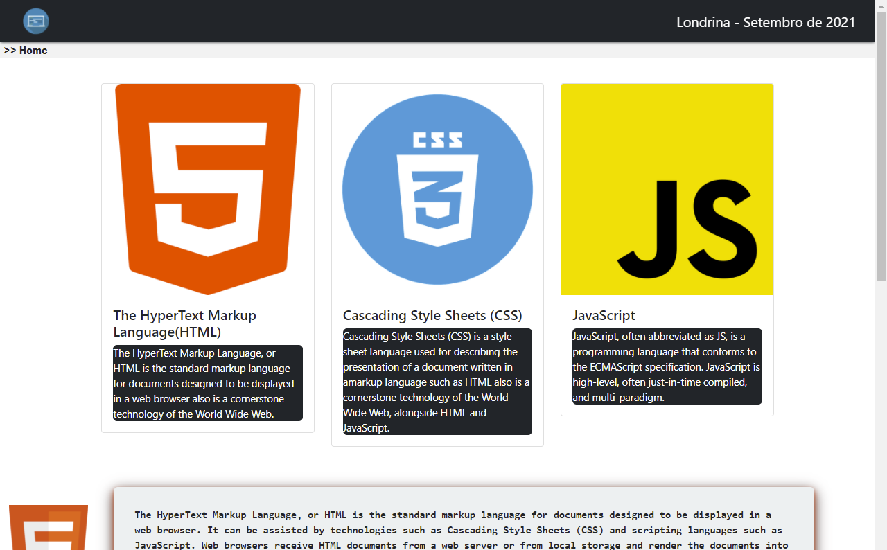

# Hello React 

> APP criado com o intuito de aprimorar minhas habilidades no desenvolvimento web focado no front-end com Reactjs.
### Ajustes e melhorias

O projeto ainda está em desenvolvimento e as próximas atualizações serão voltadas nas seguintes tarefas:

- [x] Reacriar o site criado com javascript vanilla agora utilizando Reactjs 
- [x] Implementar tabela dinamica com filtro por palavras e ordenação de dados
- [x] Implementar paginação na tabela
- [x] Receber dados da tabela a partir de uma API
- [x] Realizar deploy do App no heroku
- [ ] Criar uma nova pagina que imita o whatsapp
- [ ] Carregar as "mensagens" a partir da API

## 📝 Licença

Esse projeto está sob licença. Veja o arquivo [LICENÇA](LICENSE.md) para mais detalhes.

[⬆ Voltar ao topo](#nome-do-projeto) 
